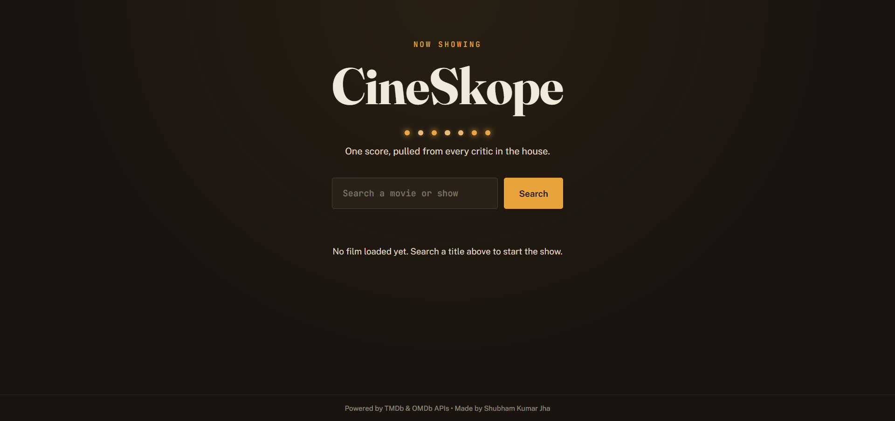
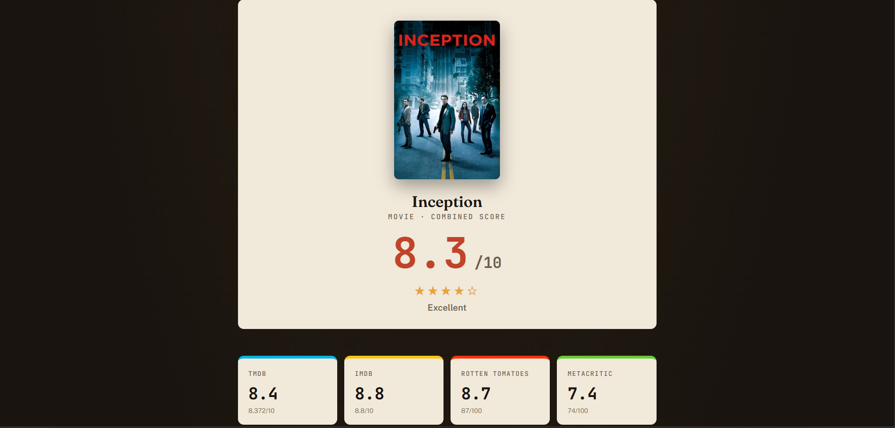
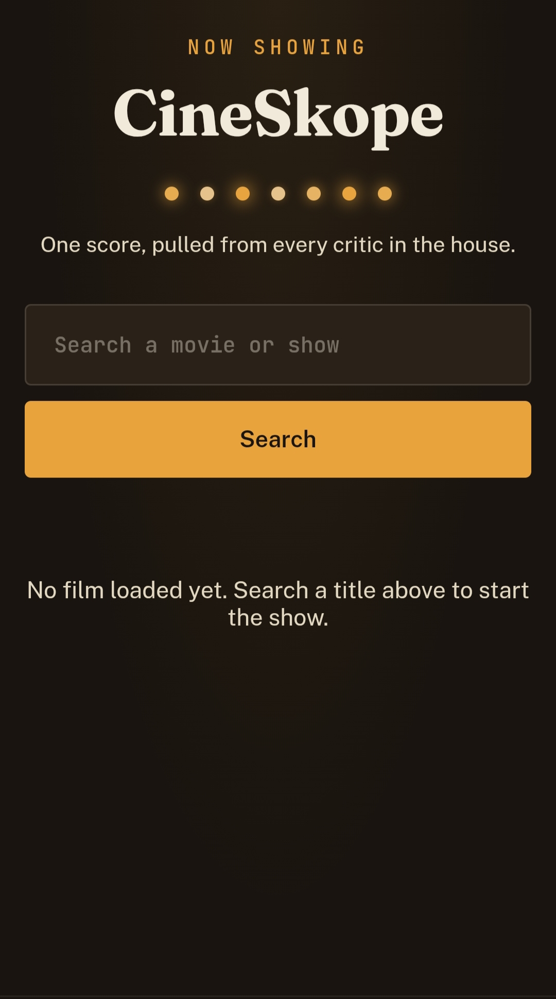
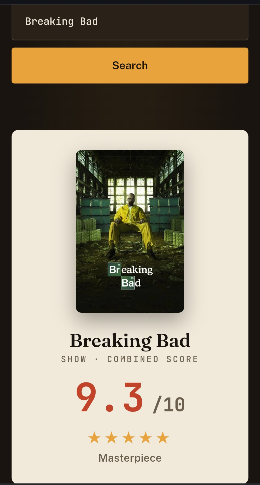

# 🎬 CineSkope


[](https://cineskope.onrender.com)
[](https://github.com/shubhamjha007/CineSkope)

**Compare movie and TV show ratings from multiple platforms in one place.**

CineSkope is a full-stack web application that allows users to search for movies and TV shows and view ratings aggregated from **IMDb**, **Rotten Tomatoes**, **TMDb**, and **Metacritic**. It presents all ratings in a clean, cinema-inspired interface along with detailed information such as plot, cast, director, runtime, genre, and awards.

## 🌐 Live Demo

**Live Application:** https://cineskope.onrender.com

## ✨ Features

- 🔍 Search movies and TV shows
- ⚡ Search autocomplete suggestions
- ⭐ Aggregated ratings from:
  - IMDb
  - Rotten Tomatoes
  - TMDb
  - Metacritic
- 🎯 Combined rating display
- 🎬 Detailed movie information
  - Overview
  - Genre
  - Runtime
  - Content Rating
  - Director
  - Cast
  - Awards
- 📱 Fully responsive design
- 🔒 Secure API key management using environment variables

---

## 📸 Screenshots

### Home Page

> 

---

### Search Results

> 

> ()

---

### Mobile View

> 

>

>  

---

## 🛠 Tech Stack

### Frontend

- HTML5
- CSS3
- JavaScript (ES6)

### Backend

- Node.js
- Express.js

### APIs

- TMDb API
- OMDb API

### Tools

- Git
- GitHub
- Render
- dotenv

---

## 📂 Project Structure

```
CineSkope
│
├── backend
│   ├── public
│   │   ├── index.html
│   │   ├── style.css
│   │   ├── script.js
│   │   └── favicon.ico
│   │
│   ├── server.js
│   ├── package.json
│   └── .env
│
├── frontend
│
└── README.md
```

---

## 🚀 Getting Started

### Clone the repository

```bash
git clone <https://github.com/shubhamjha007/CineSkope>

cd CineSkope/backend
```

### Install dependencies

```bash
npm install
```

### Create a `.env` file

```env
TMDB_API_KEY=your_tmdb_api_key
OMDB_API_KEY=your_omdb_api_key
```

### Start the server

```bash
npm start
```

Visit

```
http://localhost:5000
```

---

## 🎯 Future Improvements

- 🎥 Official movie trailers
- ❤️ Favorites / Watchlist
- 🔥 Trending movies section
- 🎬 Similar movie recommendations
- 🌙 Light/Dark theme toggle
- 📊 Weighted CineScore algorithm
- 🎭 Actor and director pages
- 🎞 Streaming platform availability

---

## 📖 What I Learned

Through this project, I gained practical experience with:

- REST API integration
- Full-stack web development
- Asynchronous JavaScript
- Express.js server development
- Environment variable management
- Git & GitHub workflows
- Deploying applications on Render
- Responsive web design

---

## 👨‍💻 Author

**Shubham Kumar Jha**

- GitHub: <https://github.com/shubhamjha007>
- LinkedIn: <https://www.linkedin.com/in/shubhamjha07/>

---

## 🙏 Acknowledgements

This project uses data provided by:

- TMDb API
- OMDb API

Special thanks to both platforms for providing public APIs for educational and development purposes.